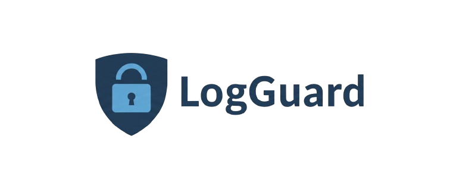

# LogGuardian

<p align="center">
  
</p>

<p align="center">
  <b>Framework de Análise e Normalização de Logs</b>  
</p>

<p align="center">
  <a href="https://www.python.org/">
    
  </a>
  <a href="./LICENSE">
    
  </a>
  <a href="https://pypi.org/project/logguardian/">
    
  </a>
</p>

---

## 📌 Visão Geral

O **LogGuardian** é um framework em Python que transforma **logs crus de servidores web** (ex.: Traefik, Nginx, Apache) em **relatórios estruturados e ricos em insights**.  

Ele permite desde a **normalização de arquivos `.log` para `.csv`**, até a **análise estatística e detecção de anomalias**, gerando relatórios em **Markdown** prontos para documentação ou auditorias.

---

## ⚙️ Funcionalidades

✅ **Normalização de Logs**: converte `.log` → `.csv`  
✅ **Análise de Segurança**: identifica padrões suspeitos e anomalias  
✅ **Relatórios Profissionais**: exportação em Markdown com gráficos  
✅ **Visualizações**: gráficos de distribuição, séries temporais e heatmaps  
✅ **Cache de IPs**: resolve geolocalização e mantém cache local em JSON  

---

## 📦 Instalação

### 🔹 Opção 1 — Usando [Poetry](https://python-poetry.org/)

```bash
git clone https://github.com/seu-usuario/LogGuardian.git
cd LogGuardian
poetry install
```

Ative o ambiente:
```bash
poetry shell
```

### 🔹 Opção 2 — Via `pip`

```bash
git clone https://github.com/seu-usuario/LogGuardian.git
cd LogGuardian
python3 -m venv .venv
source .venv/bin/activate
```

```bash
pip install .
```

---

## 🚀 Uso via CLI

Após instalar, o comando disponível será **`loguard`**.

### 📖 Ajuda

```bash
loguard -h

Framework de análise de logs Traefik

Comandos disponíveis:
    normalize <src = file.log> <out = file.csv> : Normaliza logs crus (.log) em CSV
    analyze   <src = file.csv>                  : Executa análise em CSV normalizado
    process   <src = file.log> <out = file.csv> : Executa normalização e análise em sequência
```

### 🔹 Exemplos de uso

**1. Normalizar um log cru em CSV**
```bash
loguard normalize access.log traefik.csv
```

**2. Analisar um CSV já normalizado**
```bash
loguard analyze traefik.csv
```

**3. Fazer tudo em sequência (normalize + analyze)**
```bash
loguard process access.log traefik.csv
```

📄 O relatório final será salvo em:
```
output/analysis_report.md
output/plots/
```

---

## 📂 Estrutura do Projeto

```
LogGuardian/
├── src/logguardian/        # Código-fonte principal
│   ├── cli.py              # CLI principal
│   ├── analysis.py         # Módulo de análise
│   ├── normalizer.py       # Normalização de logs
│   ├── report_generator.py # Geração de relatórios
│   └── main.py             # Ponto de entrada
├── output/                 # Saída de relatórios e gráficos
│   ├── analysis_report.md
│   ├── plots/
│   └── ip_geolocation_cache.json
├── pyproject.toml          # Configuração do Poetry
├── requirements.txt        # Dependências
├── README.md               # Documentação
└── LICENSE                 # Licença
```

---

## 🛠️ Tecnologias

- [Python 3.8+](https://www.python.org/)  
- [Pandas](https://pandas.pydata.org/) — manipulação de dados  
- [Matplotlib](https://matplotlib.org/) / [Seaborn](https://seaborn.pydata.org/) — gráficos e visualizações  
- [argparse](https://docs.python.org/3/library/argparse.html) — CLI  

---

## 📜 Licença

Distribuído sob a licença **MIT**.  
Veja o arquivo [LICENSE](./LICENSE) para mais detalhes.

---

## 🌐 Contato

👤 **Alan Torres**  
📧 alan.vstorres@ufrpe.br 
Orientador Responsável: **Rafael Perazzo**
🏫 Universidade Federal Rural de Pernambuco (UFRPE)  
🔗 [LinkedIn](https://www.linkedin.com/alanntorres) | [GitHub](https://github.com/alanntorres)

---
